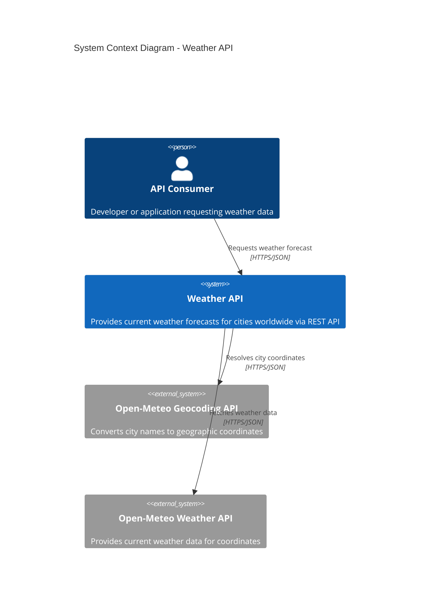

# C4 Level 1: System Context Diagram

## Overview

The System Context diagram shows the Weather API and its interactions with users and external systems. This is the highest level view of the architecture.

## Diagram

## Components

| Element | Type | Description |
|---------|------|-------------|
| API Consumer | Person | Developers, mobile apps, or web applications that consume the Weather API |
| Weather API | System | Our FastAPI-based service that orchestrates weather data retrieval |
| Open-Meteo Geocoding | External System | Free geocoding service that converts city names to lat/lon coordinates |
| Open-Meteo Weather | External System | Free weather API providing current conditions based on coordinates |

## Data Flow

1. **API Consumer** sends a request to `/forecast/{city}`
2. **Weather API** calls **Open-Meteo Geocoding** to resolve the city name to coordinates
3. **Weather API** calls **Open-Meteo Weather** with coordinates to get current conditions
4. **Weather API** transforms and returns the response to the **API Consumer**

## Key Characteristics

- **Stateless**: No database or persistent storage required
- **External Dependencies**: Relies on Open-Meteo APIs (free, no API key)
- **Single Responsibility**: Only provides weather forecast data
