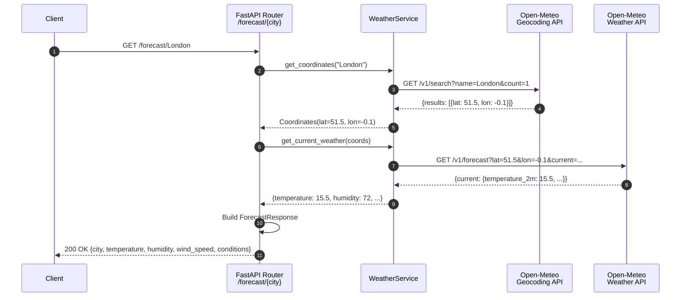
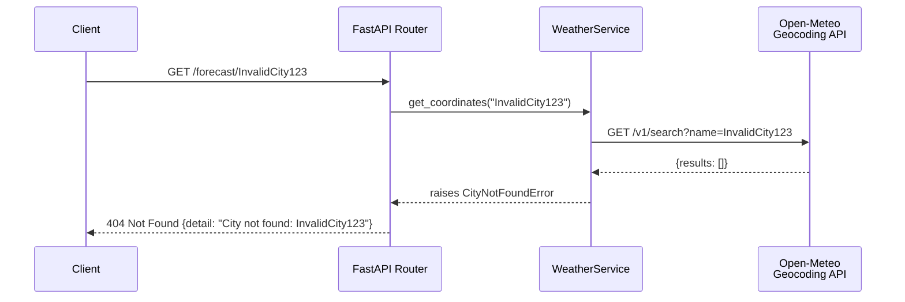
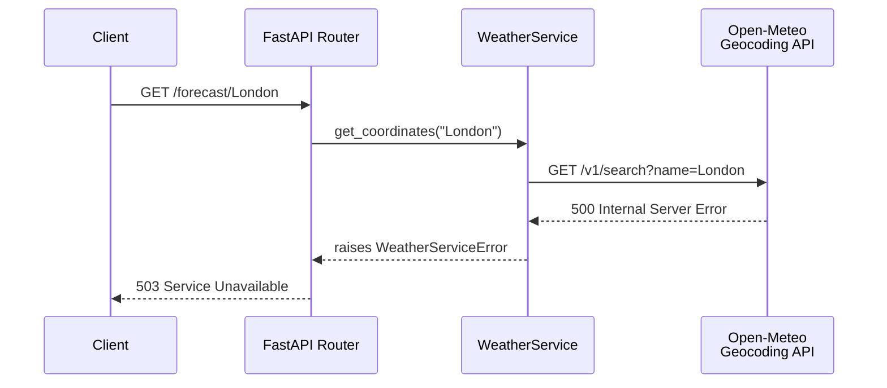

# Sequence Diagram: GET /forecast/{city}

## Overview

This diagram shows the complete request flow when a client requests weather data for a city.

## Diagram



## Error Scenarios

### City Not Found (404)



### External API Failure (503)



## Response Structure

```json
{
    "city": "London",
    "temperature": 15.5,
    "humidity": 72,
    "wind_speed": 12.3,
    "conditions": "Partly cloudy"
}
```

## Code References

- Router: `src/weather_api/routes/forecast.py:17`
- Service: `src/weather_api/services/weather.py:45`
- Schema: `src/weather_api/schemas.py:13`
