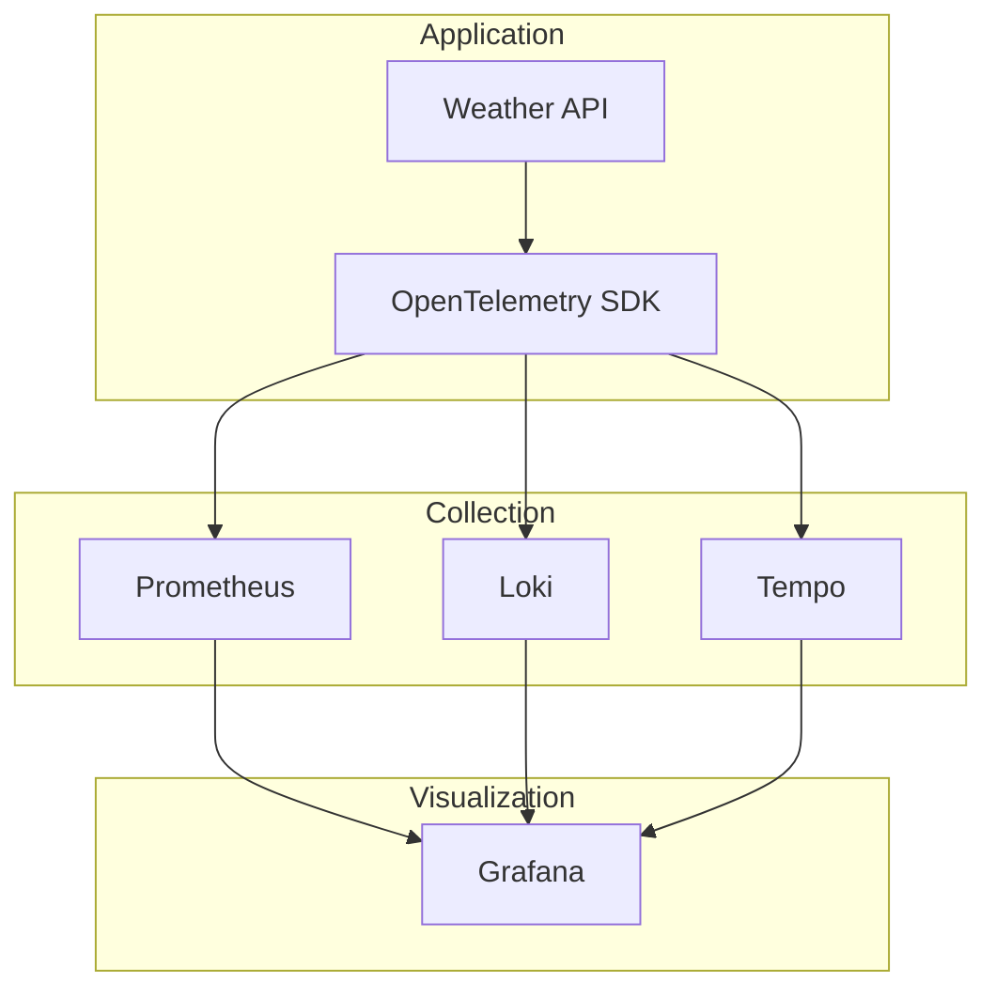

# Observability Implementation Plan

## Executive Summary

This plan details the implementation of comprehensive observability for the Weather API, covering structured logging, metrics collection, and distributed tracing to enable effective monitoring, debugging, and performance optimization in production.

## Research Findings

### Industry Standards

| Component | Recommended Tool | Alternative | Rationale |
|-----------|-----------------|-------------|-----------|
| Logging | Structlog | Python logging | Structured JSON logs, async support, context binding |
| Metrics | Prometheus + Grafana | Datadog, New Relic | Open-source, Kubernetes-native, industry standard |
| Tracing | OpenTelemetry | Jaeger, Zipkin | Vendor-neutral, CNCF standard, wide adoption |
| Log Aggregation | Loki | ELK Stack | Lightweight, Grafana-native, cost-effective |

### OpenTelemetry Analysis

OpenTelemetry provides unified observability:
- **Traces**: End-to-end request tracking
- **Metrics**: Application and runtime metrics
- **Logs**: Correlated log context (emerging)

Benefits:
- Vendor-neutral instrumentation
- Auto-instrumentation for FastAPI, httpx
- Context propagation across services
- Single SDK for all signals

### Prometheus Metrics Best Practices

| Metric Type | Use Case | Example |
|-------------|----------|---------|
| Counter | Cumulative values | Total requests, errors |
| Gauge | Current value | Active connections, queue size |
| Histogram | Distributions | Request latency, response size |
| Summary | Quantiles | P50, P95, P99 latency |

Naming convention: `<namespace>_<name>_<unit>`
Example: `weather_api_request_duration_seconds`

## Architecture



## Implementation Phases

### Phase 1: Structured Logging (Week 1)

#### Goals
- Replace print statements with structured logging
- Add request context to all logs
- Configure log levels per environment

#### Dependencies
```toml
[project]
dependencies = [
    "structlog>=24.1.0",
]
```

#### Implementation

**1. Configure Structlog**

```python
# src/weather_api/logging.py
import structlog

def configure_logging(json_format: bool = True) -> None:
    """Configure structured logging."""
    processors = [
        structlog.contextvars.merge_contextvars,
        structlog.processors.add_log_level,
        structlog.processors.TimeStamper(fmt="iso"),
        structlog.processors.StackInfoRenderer(),
    ]

    if json_format:
        processors.append(structlog.processors.JSONRenderer())
    else:
        processors.append(structlog.dev.ConsoleRenderer())

    structlog.configure(
        processors=processors,
        wrapper_class=structlog.make_filtering_bound_logger(logging.INFO),
        context_class=dict,
        logger_factory=structlog.PrintLoggerFactory(),
    )
```

**2. Add Request Context Middleware**

```python
# src/weather_api/middleware/logging.py
import uuid
import structlog
from starlette.middleware.base import BaseHTTPMiddleware

class RequestLoggingMiddleware(BaseHTTPMiddleware):
    async def dispatch(self, request: Request, call_next):
        request_id = str(uuid.uuid4())
        structlog.contextvars.clear_contextvars()
        structlog.contextvars.bind_contextvars(
            request_id=request_id,
            method=request.method,
            path=request.url.path,
        )

        logger = structlog.get_logger()
        logger.info("request_started")

        response = await call_next(request)

        logger.info("request_completed", status_code=response.status_code)
        response.headers["X-Request-ID"] = request_id
        return response
```

**3. Update Service Layer**

```python
# src/weather_api/services/weather.py
import structlog

logger = structlog.get_logger()

async def get_coordinates(city: str) -> Coordinates:
    logger.info("geocoding_started", city=city)
    # ... implementation
    logger.info("geocoding_completed", city=city, lat=coords.latitude, lon=coords.longitude)
    return coords
```

#### Log Format

```json
{
    "timestamp": "2026-01-27T14:30:00.000Z",
    "level": "info",
    "event": "request_completed",
    "request_id": "abc-123",
    "method": "GET",
    "path": "/forecast/London",
    "status_code": 200,
    "duration_ms": 245
}
```

---

### Phase 2: Prometheus Metrics (Week 2)

#### Goals
- Add HTTP request metrics
- Add external API metrics
- Expose /metrics endpoint
- Create Grafana dashboards

#### Dependencies
```toml
[project]
dependencies = [
    "prometheus-client>=0.20.0",
    "prometheus-fastapi-instrumentator>=6.1.0",
]
```

#### Implementation

**1. Define Custom Metrics**

```python
# src/weather_api/metrics.py
from prometheus_client import Counter, Histogram, Gauge

# HTTP Metrics
HTTP_REQUESTS = Counter(
    "weather_api_http_requests_total",
    "Total HTTP requests",
    ["method", "endpoint", "status"]
)

HTTP_LATENCY = Histogram(
    "weather_api_http_request_duration_seconds",
    "HTTP request latency",
    ["method", "endpoint"],
    buckets=[0.01, 0.05, 0.1, 0.25, 0.5, 1.0, 2.5, 5.0, 10.0]
)

# External API Metrics
EXTERNAL_API_REQUESTS = Counter(
    "weather_api_external_requests_total",
    "External API requests",
    ["api", "status"]
)

EXTERNAL_API_LATENCY = Histogram(
    "weather_api_external_request_duration_seconds",
    "External API latency",
    ["api"],
    buckets=[0.1, 0.25, 0.5, 1.0, 2.5, 5.0]
)

# Business Metrics
FORECAST_REQUESTS = Counter(
    "weather_api_forecast_requests_total",
    "Forecast requests by city",
    ["city", "status"]
)
```

**2. Instrument Application**

```python
# src/weather_api/main.py
from prometheus_fastapi_instrumentator import Instrumentator

app = FastAPI(...)

# Auto-instrument FastAPI
Instrumentator().instrument(app).expose(app)
```

**3. Instrument External Calls**

```python
# src/weather_api/services/weather.py
import time
from weather_api.metrics import EXTERNAL_API_REQUESTS, EXTERNAL_API_LATENCY

async def get_coordinates(city: str) -> Coordinates:
    start = time.time()
    try:
        response = await client.get(GEOCODING_URL, params={"name": city})
        EXTERNAL_API_REQUESTS.labels(api="geocoding", status="success").inc()
        return parse_response(response)
    except Exception:
        EXTERNAL_API_REQUESTS.labels(api="geocoding", status="error").inc()
        raise
    finally:
        EXTERNAL_API_LATENCY.labels(api="geocoding").observe(time.time() - start)
```

#### Key Metrics

| Metric | Query | Purpose |
|--------|-------|---------|
| Request Rate | `rate(weather_api_http_requests_total[5m])` | Traffic volume |
| Error Rate | `rate(weather_api_http_requests_total{status=~"5.."}[5m])` | Error tracking |
| P95 Latency | `histogram_quantile(0.95, rate(weather_api_http_request_duration_seconds_bucket[5m]))` | Performance |
| External API Health | `rate(weather_api_external_requests_total{status="error"}[5m])` | Dependency health |

---

### Phase 3: Distributed Tracing (Week 3)

#### Goals
- Add OpenTelemetry instrumentation
- Trace requests across services
- Correlate logs with traces
- Deploy Tempo for trace storage

#### Dependencies
```toml
[project]
dependencies = [
    "opentelemetry-api>=1.22.0",
    "opentelemetry-sdk>=1.22.0",
    "opentelemetry-instrumentation-fastapi>=0.43b0",
    "opentelemetry-instrumentation-httpx>=0.43b0",
    "opentelemetry-exporter-otlp>=1.22.0",
]
```

#### Implementation

**1. Configure OpenTelemetry**

```python
# src/weather_api/telemetry.py
from opentelemetry import trace
from opentelemetry.sdk.trace import TracerProvider
from opentelemetry.sdk.trace.export import BatchSpanProcessor
from opentelemetry.exporter.otlp.proto.grpc.trace_exporter import OTLPSpanExporter
from opentelemetry.instrumentation.fastapi import FastAPIInstrumentor
from opentelemetry.instrumentation.httpx import HTTPXClientInstrumentor

def configure_telemetry(service_name: str, otlp_endpoint: str) -> None:
    """Configure OpenTelemetry tracing."""
    provider = TracerProvider(
        resource=Resource.create({"service.name": service_name})
    )

    exporter = OTLPSpanExporter(endpoint=otlp_endpoint)
    provider.add_span_processor(BatchSpanProcessor(exporter))

    trace.set_tracer_provider(provider)

    # Auto-instrument
    FastAPIInstrumentor.instrument()
    HTTPXClientInstrumentor().instrument()
```

**2. Add Custom Spans**

```python
# src/weather_api/services/weather.py
from opentelemetry import trace

tracer = trace.get_tracer(__name__)

async def get_coordinates(city: str) -> Coordinates:
    with tracer.start_as_current_span("geocoding") as span:
        span.set_attribute("city", city)
        span.set_attribute("api", "open-meteo")

        response = await client.get(GEOCODING_URL, params={"name": city})

        span.set_attribute("status_code", response.status_code)

        if response.status_code != 200:
            span.set_status(StatusCode.ERROR, "Geocoding failed")
            raise WeatherServiceError(...)

        coords = parse_response(response)
        span.set_attribute("latitude", coords.latitude)
        span.set_attribute("longitude", coords.longitude)

        return coords
```

**3. Correlate Logs with Traces**

```python
# src/weather_api/logging.py
from opentelemetry import trace

def add_trace_context(logger, method_name, event_dict):
    """Add trace context to log entries."""
    span = trace.get_current_span()
    if span.is_recording():
        ctx = span.get_span_context()
        event_dict["trace_id"] = format(ctx.trace_id, "032x")
        event_dict["span_id"] = format(ctx.span_id, "016x")
    return event_dict
```

---

### Phase 4: Kubernetes Deployment (Week 4)

#### Observability Stack

```yaml
# k8s/observability/prometheus.yaml
apiVersion: v1
kind: ConfigMap
metadata:
  name: prometheus-config
data:
  prometheus.yml: |
    global:
      scrape_interval: 15s
    scrape_configs:
      - job_name: 'weather-api'
        kubernetes_sd_configs:
          - role: pod
        relabel_configs:
          - source_labels: [__meta_kubernetes_pod_label_app]
            regex: weather-api
            action: keep
```

```yaml
# k8s/observability/loki.yaml
apiVersion: apps/v1
kind: Deployment
metadata:
  name: loki
spec:
  template:
    spec:
      containers:
        - name: loki
          image: grafana/loki:2.9.0
          ports:
            - containerPort: 3100
```

```yaml
# k8s/observability/tempo.yaml
apiVersion: apps/v1
kind: Deployment
metadata:
  name: tempo
spec:
  template:
    spec:
      containers:
        - name: tempo
          image: grafana/tempo:2.3.0
          ports:
            - containerPort: 4317  # OTLP gRPC
            - containerPort: 3200  # Query
```

#### Update Weather API Deployment

```yaml
# k8s/deployments/weather-api.yaml
spec:
  template:
    spec:
      containers:
        - name: weather-api
          env:
            - name: OTEL_EXPORTER_OTLP_ENDPOINT
              value: "http://tempo:4317"
            - name: OTEL_SERVICE_NAME
              value: "weather-api"
            - name: LOG_FORMAT
              value: "json"
          ports:
            - containerPort: 8000
            - containerPort: 9090  # Metrics
```

---

## Grafana Dashboards

### Weather API Overview Dashboard

| Panel | Query | Visualization |
|-------|-------|---------------|
| Request Rate | `sum(rate(weather_api_http_requests_total[5m]))` | Stat |
| Error Rate | `sum(rate(weather_api_http_requests_total{status=~"5.."}[5m])) / sum(rate(weather_api_http_requests_total[5m]))` | Gauge |
| P95 Latency | `histogram_quantile(0.95, sum(rate(weather_api_http_request_duration_seconds_bucket[5m])) by (le))` | Time series |
| Requests by Endpoint | `sum(rate(weather_api_http_requests_total[5m])) by (endpoint)` | Bar chart |
| External API Health | `sum(rate(weather_api_external_requests_total{status="error"}[5m])) by (api)` | Time series |

---

## Alerting Rules

```yaml
# alerting-rules.yaml
groups:
  - name: weather-api-alerts
    rules:
      - alert: HighErrorRate
        expr: |
          sum(rate(weather_api_http_requests_total{status=~"5.."}[5m]))
          / sum(rate(weather_api_http_requests_total[5m])) > 0.05
        for: 5m
        labels:
          severity: critical
        annotations:
          summary: High error rate detected
          description: Error rate is {{ $value | humanizePercentage }}

      - alert: HighLatency
        expr: |
          histogram_quantile(0.95,
            sum(rate(weather_api_http_request_duration_seconds_bucket[5m])) by (le)
          ) > 2
        for: 5m
        labels:
          severity: warning
        annotations:
          summary: High latency detected
          description: P95 latency is {{ $value }}s

      - alert: ExternalAPIDown
        expr: |
          sum(rate(weather_api_external_requests_total{status="error"}[5m]))
          / sum(rate(weather_api_external_requests_total[5m])) > 0.5
        for: 2m
        labels:
          severity: critical
        annotations:
          summary: External API failures detected
```

---

## Timeline

| Phase | Duration | Deliverables |
|-------|----------|--------------|
| Phase 1 | Week 1 | Structured logging, request context |
| Phase 2 | Week 2 | Prometheus metrics, /metrics endpoint |
| Phase 3 | Week 3 | OpenTelemetry tracing, log correlation |
| Phase 4 | Week 4 | K8s deployment, Grafana dashboards, alerts |

## Success Metrics

| Metric | Target |
|--------|--------|
| Log coverage | 100% of requests logged |
| Metrics endpoint | Available at /metrics |
| Trace coverage | 100% of requests traced |
| Dashboard availability | Grafana accessible |
| Alert coverage | Critical paths monitored |

## Dependencies to Add

```toml
[project]
dependencies = [
    # Existing...
    "structlog>=24.1.0",
    "prometheus-client>=0.20.0",
    "prometheus-fastapi-instrumentator>=6.1.0",
    "opentelemetry-api>=1.22.0",
    "opentelemetry-sdk>=1.22.0",
    "opentelemetry-instrumentation-fastapi>=0.43b0",
    "opentelemetry-instrumentation-httpx>=0.43b0",
    "opentelemetry-exporter-otlp>=1.22.0",
]
```
