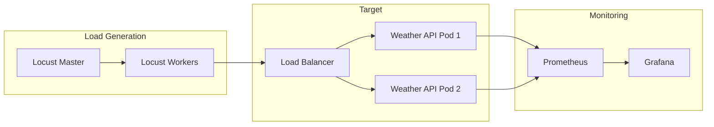

# Performance Benchmark Plan

## Executive Summary

This plan establishes a comprehensive performance benchmarking and optimization strategy for the Weather API, including baseline measurements, load testing, profiling, and optimization implementation.

## Research Findings

### Benchmarking Tools Analysis

| Tool | Type | Strengths | Best For |
|------|------|-----------|----------|
| **Locust** | Load testing | Python-native, scenarios, distributed | User simulation |
| **wrk** | HTTP benchmark | High performance, simple | Raw throughput |
| **k6** | Load testing | JavaScript, cloud-native | CI integration |
| **pytest-benchmark** | Micro-benchmark | pytest integration, statistics | Function profiling |
| **Apache Bench (ab)** | HTTP benchmark | Simple, ubiquitous | Quick tests |

### Profiling Tools Analysis

| Tool | Type | Use Case |
|------|------|----------|
| **py-spy** | CPU sampling | Production-safe profiling |
| **cProfile** | CPU deterministic | Detailed call graphs |
| **memray** | Memory | Allocation tracking |
| **scalene** | CPU + Memory | Combined profiling |
| **yappi** | Async-aware | Coroutine profiling |

### FastAPI Performance Characteristics

| Component | Typical Latency | Optimization |
|-----------|-----------------|--------------|
| Request parsing | ~0.1ms | Minimal |
| Pydantic validation | ~0.5ms | Use Pydantic v2 |
| Route matching | ~0.05ms | Minimal |
| Response serialization | ~0.5ms | Use orjson |
| **External API call** | **100-500ms** | **Caching, pooling** |

Key insight: External API calls dominate latency. Optimization should focus here.

## Performance Targets

### Latency Requirements

| Percentile | Target | Maximum | Notes |
|------------|--------|---------|-------|
| P50 | 200ms | 300ms | Median response time |
| P95 | 500ms | 1000ms | 95th percentile |
| P99 | 1000ms | 2000ms | Tail latency |

### Throughput Requirements

| Metric | Target | Notes |
|--------|--------|-------|
| RPS (single instance) | 100 | Requests per second |
| RPS (2 replicas) | 180 | With load balancing |
| Concurrent users | 500 | Without degradation |

### Resource Limits

| Resource | Per Pod | Notes |
|----------|---------|-------|
| CPU | 500m | Half a core |
| Memory | 256Mi | Container limit |
| Connections | 100 | HTTP client pool |

## Benchmark Architecture



## Implementation Phases

### Phase 1: Baseline Measurement (Week 1)

#### Goals
- Establish current performance baseline
- Identify bottlenecks
- Document baseline metrics

#### Setup

**1. Install Benchmarking Tools**

```bash
# Add dev dependencies
uv add --dev locust pytest-benchmark

# Install system tools
sudo apt install wrk
```

**2. Create Locust Test File**

```python
# tests/performance/locustfile.py
"""Load test scenarios for Weather API."""

import random
from locust import HttpUser, task, between, tag

class WeatherAPIUser(HttpUser):
    """Simulates typical API user behavior."""

    wait_time = between(0.5, 2.0)

    # Sample cities for testing
    CITIES = [
        "London", "Paris", "Tokyo", "New York", "Sydney",
        "Berlin", "Madrid", "Rome", "Toronto", "Singapore"
    ]

    @task(1)
    @tag("health")
    def health_check(self) -> None:
        """Check health endpoint."""
        self.client.get("/health")

    @task(10)
    @tag("forecast")
    def get_forecast(self) -> None:
        """Get forecast for random city."""
        city = random.choice(self.CITIES)
        with self.client.get(
            f"/forecast/{city}",
            name="/forecast/[city]",
            catch_response=True
        ) as response:
            if response.status_code == 200:
                response.success()
            elif response.status_code == 404:
                response.success()  # Expected for some cities
            else:
                response.failure(f"Unexpected status: {response.status_code}")

    @task(5)
    @tag("forecast", "popular")
    def get_forecast_popular(self) -> None:
        """Get forecast for popular cities (cache-friendly)."""
        city = random.choice(["London", "New York", "Tokyo"])
        self.client.get(f"/forecast/{city}", name="/forecast/[popular]")


class HealthCheckUser(HttpUser):
    """User that only checks health (for baseline)."""

    wait_time = between(0.1, 0.5)

    @task
    def health_check(self) -> None:
        self.client.get("/health")
```

**3. Create pytest Benchmarks**

```python
# tests/performance/test_benchmarks.py
"""Micro-benchmarks for critical functions."""

import pytest
from weather_api.services.weather import get_conditions, WMO_CODES
from weather_api.schemas import Coordinates, ForecastResponse


class TestMicroBenchmarks:
    """Micro-benchmarks for hot path functions."""

    def test_get_conditions_benchmark(self, benchmark) -> None:
        """Benchmark weather code lookup."""
        result = benchmark(get_conditions, 2)
        assert result == "Partly cloudy"

    def test_coordinates_creation_benchmark(self, benchmark) -> None:
        """Benchmark Pydantic model creation."""
        def create_coords():
            return Coordinates(latitude=51.5074, longitude=-0.1278)

        result = benchmark(create_coords)
        assert result.latitude == 51.5074

    def test_forecast_response_benchmark(self, benchmark) -> None:
        """Benchmark response model creation."""
        def create_response():
            return ForecastResponse(
                city="London",
                temperature=15.5,
                humidity=72,
                wind_speed=12.3,
                conditions="Partly cloudy"
            )

        result = benchmark(create_response)
        assert result.city == "London"

    def test_wmo_codes_lookup_benchmark(self, benchmark) -> None:
        """Benchmark dict lookup performance."""
        def lookup_code():
            return WMO_CODES.get(65, "Unknown")

        result = benchmark(lookup_code)
        assert result == "Heavy rain"
```

#### Baseline Tests

```bash
# 1. Quick health check baseline
wrk -t2 -c10 -d10s http://localhost:8000/health

# 2. Forecast endpoint baseline (mocked external)
wrk -t2 -c10 -d10s http://localhost:8000/forecast/London

# 3. Locust baseline test
locust -f tests/performance/locustfile.py \
    --host=http://localhost:8000 \
    --users=50 --spawn-rate=10 \
    --run-time=60s --headless \
    --csv=baseline

# 4. Micro-benchmarks
uv run pytest tests/performance/test_benchmarks.py --benchmark-only
```

#### Baseline Report Template

```markdown
## Baseline Performance Report

**Date**: 2026-01-27
**Version**: 0.1.0
**Environment**: Local, single instance

### Health Endpoint
| Metric | Value |
|--------|-------|
| P50 | Xms |
| P95 | Xms |
| P99 | Xms |
| RPS | X |

### Forecast Endpoint
| Metric | Value |
|--------|-------|
| P50 | Xms |
| P95 | Xms |
| P99 | Xms |
| RPS | X |

### Bottlenecks Identified
1. ...
2. ...
```

---

### Phase 2: Profiling & Analysis (Week 2)

#### Goals
- Profile CPU and memory usage
- Identify hot paths
- Analyze async performance

#### CPU Profiling

```bash
# 1. Record profile with py-spy
py-spy record -o profile.svg --pid $(pgrep -f uvicorn)

# Run load while profiling
wrk -t4 -c50 -d30s http://localhost:8000/forecast/London

# 2. Generate flame graph
py-spy dump --pid $(pgrep -f uvicorn)
```

#### Memory Profiling

```bash
# 1. Run with memray
memray run -o weather_api.bin -m uvicorn weather_api.main:app

# 2. Generate flame graph
memray flamegraph weather_api.bin -o memory_flame.html

# 3. Check for leaks
memray summary weather_api.bin
```

#### Async Profiling

```python
# tests/performance/test_async_profile.py
"""Async-aware profiling."""

import yappi
import asyncio

async def profile_forecast():
    """Profile forecast endpoint calls."""
    yappi.set_clock_type("wall")
    yappi.start()

    # Simulate concurrent requests
    async with httpx.AsyncClient() as client:
        tasks = [
            client.get("http://localhost:8000/forecast/London")
            for _ in range(100)
        ]
        await asyncio.gather(*tasks)

    yappi.stop()

    # Print stats
    func_stats = yappi.get_func_stats()
    func_stats.sort("ttot", "desc")
    func_stats.print_all()
```

#### Analysis Checklist

- [ ] CPU flame graph reviewed
- [ ] Memory allocations analyzed
- [ ] Async bottlenecks identified
- [ ] External API call timing measured
- [ ] Serialization overhead measured

---

### Phase 3: Optimization Implementation (Week 3)

#### Optimization 1: HTTP Client Connection Pooling

**Problem**: New connection per request
**Solution**: Shared async client with connection pool

```python
# src/weather_api/clients/http.py
"""Shared HTTP client with connection pooling."""

import httpx
from contextlib import asynccontextmanager

_client: httpx.AsyncClient | None = None

def get_client() -> httpx.AsyncClient:
    """Get shared HTTP client."""
    global _client
    if _client is None:
        _client = httpx.AsyncClient(
            limits=httpx.Limits(
                max_connections=100,
                max_keepalive_connections=20,
                keepalive_expiry=30.0
            ),
            timeout=httpx.Timeout(10.0, connect=5.0),
            http2=True  # Enable HTTP/2
        )
    return _client

async def close_client() -> None:
    """Close shared client on shutdown."""
    global _client
    if _client:
        await _client.aclose()
        _client = None

# In main.py
@app.on_event("shutdown")
async def shutdown():
    await close_client()
```

**Expected improvement**: 10-20% latency reduction

#### Optimization 2: Response Caching

**Problem**: Repeated geocoding for same cities
**Solution**: In-memory TTL cache

```python
# src/weather_api/cache.py
"""Caching for external API responses."""

from cachetools import TTLCache
from typing import TypeVar, Callable, Awaitable
import functools

T = TypeVar("T")

# Geocoding cache (cities don't move)
geocoding_cache: TTLCache[str, "Coordinates"] = TTLCache(
    maxsize=10000,
    ttl=86400  # 24 hours
)

# Weather cache (short TTL)
weather_cache: TTLCache[tuple[float, float], dict] = TTLCache(
    maxsize=1000,
    ttl=300  # 5 minutes
)

def cached_geocoding(func: Callable[..., Awaitable[T]]) -> Callable[..., Awaitable[T]]:
    """Decorator for caching geocoding results."""
    @functools.wraps(func)
    async def wrapper(city: str) -> T:
        cache_key = city.lower().strip()
        if cache_key in geocoding_cache:
            return geocoding_cache[cache_key]
        result = await func(city)
        geocoding_cache[cache_key] = result
        return result
    return wrapper
```

**Expected improvement**: 50-80% latency for cached cities

#### Optimization 3: Faster JSON Serialization

**Problem**: Standard JSON encoder is slow
**Solution**: Use orjson

```bash
uv add orjson
```

```python
# src/weather_api/main.py
from fastapi.responses import ORJSONResponse

app = FastAPI(
    title="Weather API",
    default_response_class=ORJSONResponse
)
```

**Expected improvement**: 2-5x faster serialization

#### Optimization 4: Pydantic V2 Optimizations

```python
# src/weather_api/schemas.py
from pydantic import BaseModel, ConfigDict

class ForecastResponse(BaseModel):
    model_config = ConfigDict(
        # Faster validation
        validate_default=False,
        # Faster serialization
        ser_json_bytes="utf8",
    )

    city: str
    temperature: float
    humidity: int
    wind_speed: float
    conditions: str
```

**Expected improvement**: 5-10% validation speedup

---

### Phase 4: Load Testing & Validation (Week 4)

#### Load Test Scenarios

**Scenario 1: Sustained Load**
```bash
locust -f tests/performance/locustfile.py \
    --host=http://localhost:8000 \
    --users=100 --spawn-rate=10 \
    --run-time=10m --headless \
    --csv=sustained_load
```

**Scenario 2: Spike Test**
```bash
locust -f tests/performance/locustfile.py \
    --host=http://localhost:8000 \
    --users=500 --spawn-rate=100 \
    --run-time=5m --headless \
    --csv=spike_test
```

**Scenario 3: Stress Test**
```bash
locust -f tests/performance/locustfile.py \
    --host=http://localhost:8000 \
    --users=1000 --spawn-rate=50 \
    --run-time=15m --headless \
    --csv=stress_test
```

**Scenario 4: Endurance Test**
```bash
locust -f tests/performance/locustfile.py \
    --host=http://localhost:8000 \
    --users=50 --spawn-rate=5 \
    --run-time=2h --headless \
    --csv=endurance_test
```

#### Kubernetes Load Test

```bash
# Deploy load generator in cluster
kubectl apply -f k8s/testing/locust-master.yaml
kubectl apply -f k8s/testing/locust-worker.yaml

# Scale workers
kubectl scale deployment locust-worker --replicas=5

# Port forward to Locust UI
kubectl port-forward svc/locust-master 8089:8089
```

#### Validation Criteria

| Test | Pass Criteria |
|------|---------------|
| Sustained Load | P95 < 500ms, 0% errors |
| Spike Test | Recovery < 30s, < 1% errors |
| Stress Test | Graceful degradation, no crashes |
| Endurance Test | No memory leaks, stable latency |

---

## Continuous Performance Testing

### CI Integration

```yaml
# .github/workflows/performance.yml
name: Performance Tests

on:
  push:
    branches: [master]
  schedule:
    - cron: '0 0 * * 0'  # Weekly

jobs:
  benchmark:
    runs-on: ubuntu-latest
    steps:
      - uses: actions/checkout@v4

      - name: Setup
        run: |
          pip install uv
          uv sync

      - name: Start server
        run: |
          uv run uvicorn weather_api.main:app &
          sleep 5

      - name: Run benchmarks
        run: |
          uv run pytest tests/performance/test_benchmarks.py \
            --benchmark-only \
            --benchmark-json=benchmark.json

      - name: Check regression
        run: |
          # Compare with baseline
          python scripts/check_regression.py benchmark.json
```

### Performance Budget

```python
# tests/performance/test_budget.py
"""Performance budget tests."""

import pytest
import httpx
import time

LATENCY_BUDGET_MS = {
    "/health": 50,
    "/forecast/{city}": 500,
}

@pytest.mark.performance
async def test_latency_budget():
    """Ensure endpoints meet latency budget."""
    async with httpx.AsyncClient(base_url="http://localhost:8000") as client:
        for endpoint, budget in LATENCY_BUDGET_MS.items():
            path = endpoint.replace("{city}", "London")

            start = time.perf_counter()
            response = await client.get(path)
            duration_ms = (time.perf_counter() - start) * 1000

            assert response.status_code in (200, 404)
            assert duration_ms < budget, f"{endpoint} exceeded budget: {duration_ms}ms > {budget}ms"
```

---

## Timeline

| Phase | Duration | Deliverables |
|-------|----------|--------------|
| Phase 1 | Week 1 | Baseline metrics, bottleneck analysis |
| Phase 2 | Week 2 | Profiling results, optimization plan |
| Phase 3 | Week 3 | Implemented optimizations, unit tests |
| Phase 4 | Week 4 | Load test results, validation report |

## Success Metrics

| Metric | Baseline | Target | Stretch |
|--------|----------|--------|---------|
| P50 Latency | TBD | 200ms | 100ms |
| P95 Latency | TBD | 500ms | 300ms |
| Throughput | TBD | 100 RPS | 200 RPS |
| Cache Hit Rate | 0% | 60% | 80% |

## Dependencies to Add

```toml
[dependency-groups]
dev = [
    # Existing...
    "locust>=2.20.0",
    "pytest-benchmark>=4.0.0",
]

[project]
dependencies = [
    # Existing...
    "orjson>=3.9.0",
    "cachetools>=5.3.0",
]
```
