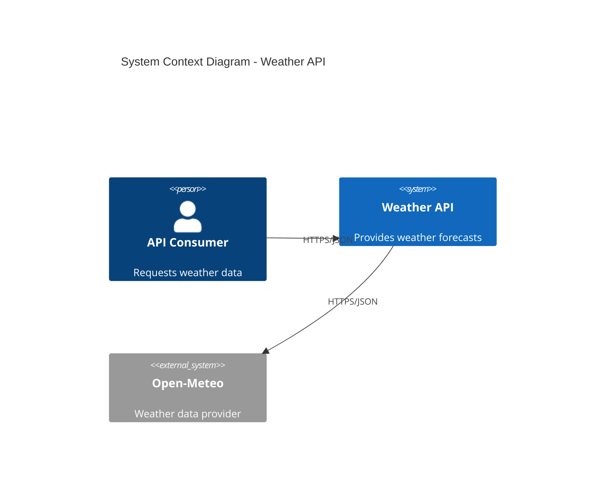
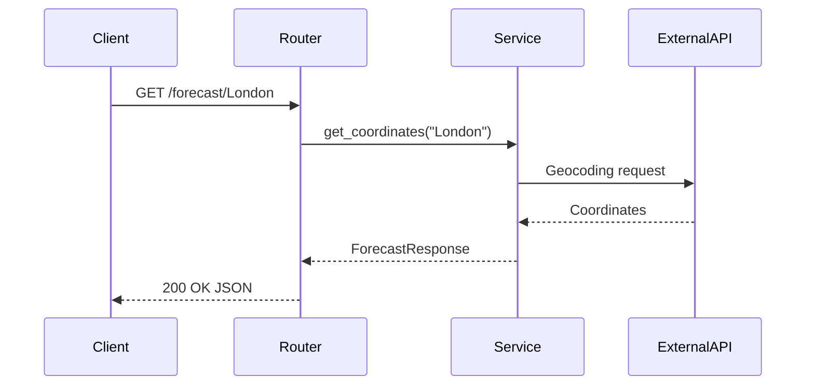

# Skill: Architecture Diagrams

## Purpose

Generate and maintain architecture documentation using C4 model diagrams and sequence diagrams for the Weather API project.

## Triggers

- "Create a C4 Level 1 diagram"
- "Show a C4 container diagram"
- "Generate a sequence diagram for..."
- "Update the architecture diagram"
- "Document the system architecture"

## Rules

### C4 Model Levels

| Level | Name | When to Use |
|-------|------|-------------|
| 1 | System Context | Always required. Shows system and external actors |
| 2 | Container | Infrastructure changes (new services, databases) |
| 3 | Component | Major features affecting internal modules |
| 4 | Code | Detailed class/function relationships (on request) |

### Diagram Format

- **Default**: Mermaid syntax
- **Alternative**: PlantUML (if explicitly requested)
- **Location**: `docs/architecture/`

### Naming Conventions

| Component | Naming |
|-----------|--------|
| System | WeatherAPI |
| Services | ForecastService, WeatherService |
| External | OpenMeteoAPI, OpenMeteoGeocoding |
| Actors | APIConsumer, Developer |

### Required Elements

Every diagram must include:
1. Title describing the diagram
2. Legend for shapes/colors (if complex)
3. Brief explanation paragraph
4. Data flow descriptions

## Examples

### C4 Level 1 Request
**Input**: "Create a C4 Level 1 diagram for the Weather API"

**Output**:

### Sequence Diagram Request
**Input**: "Generate a sequence diagram for GET /forecast/{city}"

**Output**:

## Extensions

### Adding New Diagram Types

1. Define the diagram type and purpose
2. Add Mermaid/PlantUML template
3. Document naming conventions
4. Add example to this skill file

### Supported Extensions

- Deployment diagrams (Kubernetes architecture)
- Data flow diagrams
- State machine diagrams
- Entity relationship diagrams
